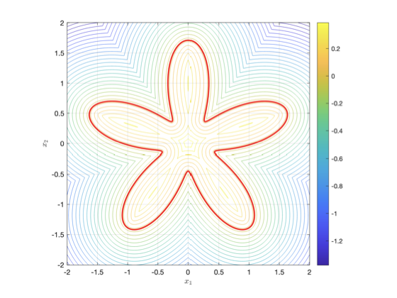
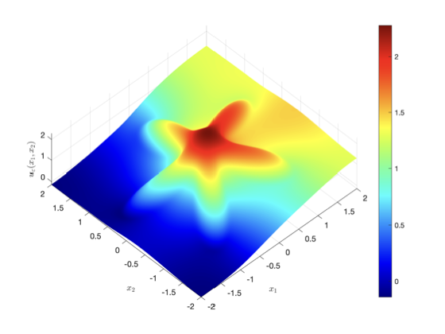

# DiffuseDomainHelmholtz

This repository packages two MATLAB codebases for cell-centered multigrid solvers of Helmholtz-type elliptic problems, including diffuse-domain/interface formulations.

- `HelmholtzMultigrid/`: baseline line/box solvers from the refined book code.
- `DiffuseDomainMultigrid/`: refactored diffuse-domain solvers built on that baseline, with signed-distance/eikonal-based geometry handling.

## Repository Layout

```
DiffuseDomainHelmholtz/
├── HelmholtzMultigrid/
│   ├── 1DCC/
│   └── 2DCC/
├── DiffuseDomainMultigrid/
│   ├── 1DCC/
│   ├── 1DCC Convergence Analysis/
│   ├── 2DCC/
│   └── 2DCC Convergence Analysis/
├── LICENSE
└── README.md
```

## Mathematical Problems

### 1D and 2D baseline Helmholtz-type model

The baseline book code solves the generalized Helmholtz operator on a line/box:

**1D**

$$
-\frac{d}{dx}\left(D(x)\frac{du}{dx}\right) + C(x)u = f(x)
$$

**2D**

$$
-\nabla\cdot\left(D(x,y)\nabla u\right) + C(x,y)u = f(x,y)
$$

with cell-centered finite differences and geometric multigrid. Depending on the script, homogeneous Dirichlet, Neumann, or periodic boundary conditions are supported.

### Diffuse Domain formulation (refactored code)

For interface/transmission problems, the code embeds the interface problem into a larger Cartesian box using a smooth phase field $\phi_\varepsilon$, derived from signed distance $d$:

$$
\phi_\varepsilon = \frac{1}{2}\left(1+\tanh\left(\frac{d}{\varepsilon}\right)\right)
$$

The diffuse-domain PDE solved on the box is:

$$
-\nabla\cdot(D_\varepsilon\nabla u_\varepsilon) + c_\varepsilon u_\varepsilon + (\kappa u_\varepsilon + g)|\nabla \phi_\varepsilon| = f_\varepsilon
$$

with

$$
\begin{aligned}
D_\varepsilon &= \alpha+(1-\alpha)\phi_\varepsilon, \\
c_\varepsilon &= \beta(1-\phi_\varepsilon)+\gamma\phi_\varepsilon, \\
f_\varepsilon &= h(1-\phi_\varepsilon)+q\phi_\varepsilon.
\end{aligned}
$$

In implementation, this is rearranged into the multigrid solver form

$$
-\nabla\cdot(D\nabla u) + Cu = F,
$$

where

$$
\begin{aligned}
D &= D_\varepsilon, \\
C &= c_\varepsilon + \kappa|\nabla\phi_\varepsilon|, \\
F &= f_\varepsilon - g|\nabla\phi_\varepsilon|.
\end{aligned}
$$

In 1D one-sided/two-sided examples, the jump condition appears as
$u'_R(0)-\alpha u'_L(0)=\kappa u(0)+\lambda$, and its diffuse approximation is built through the $\phi_\varepsilon$-weighted coefficients and forcing.

## Eikonal / Signed-Distance Step

The 2D DDM codes require a signed distance function to the interface. This is computed by a Fast Marching style solver (MEX C++) and used to build $\phi_\varepsilon$ and $|\nabla\phi_\varepsilon|$.

- Fast option: `mex_computeSignedDistance.cpp`
- Portable fallback: `computeSignedDistance_MATLAB.m` (slower)

In this package, `computeSignedDistance.m` is set to use MEX when available and automatically fall back to pure MATLAB if not.

## Numerical Method Summary

All included solvers use:

- Cell-centered finite-difference discretization (with ghost-cell boundary handling)
- Geometric multigrid (V/W-cycle variants in scripts)
- Smoothers such as damped Jacobi / damped Gauss-Seidel
- Restriction/prolongation transfer operators for level coupling

The convergence-analysis folders run parameter sweeps (e.g., in $\varepsilon$, $\alpha$, or coupled laws $\alpha=\varepsilon^p$) to estimate asymptotic behavior.

## Quick Start (MATLAB)

Run from the target folder in MATLAB.

### Baseline Helmholtz multigrid

- `HelmholtzMultigrid/1DCC/elliptic1DMGCCDiff.m`
- `HelmholtzMultigrid/2DCC/elliptic2DMGCCDiff.m`

### Diffuse domain multigrid

- `DiffuseDomainMultigrid/1DCC/elliptic1DMGCCDiff.m`
- `DiffuseDomainMultigrid/1DCC/DDMSolver1DOneSided.m` (one-sided benchmark)
- `DiffuseDomainMultigrid/1DCC Convergence Analysis/DDMSolver1DOneSided.m`
- `DiffuseDomainMultigrid/2DCC/elliptic2DMGCCDiff.m`
- `DiffuseDomainMultigrid/2DCC Convergence Analysis/ConvergenceAnalysis2D.m`

Optional MEX compilation (for speed in 2D distance computation):

```matlab
mex mex_computeSignedDistance.cpp
```

## Example Plots

The following figures are included in this repository. Click each preview to open the original PDF.

### 2D Star-Shaped Domain

[](TwoDStarDomain.pdf)

### 2D Star-Domain Solution

[](TwoDStarDomainSolution.pdf)

## Packaging Notes

To keep this repository portable and GitHub-friendly, precomputed cache/data files (`*.mat`), platform-specific binaries (`*.mex*`), and system files (`.DS_Store`) were excluded from this package. Scripts regenerate needed cache files during execution.

## References

- Paper 1: [A Diffuse Domain Approximation with Transmission-Type Boundary Conditions I: Asymptotic Analysis and Numerics](https://arxiv.org/abs/2412.07007)
- Paper 2: [A Diffuse Domain Approximation with Transmission-Type Boundary Conditions II: Gamma--Convergence](https://arxiv.org/abs/2504.17148)
- Book: [Multigrid Methods](https://doi.org/10.1515/9783111354880)
- Book repository: [stevenmwise/MultigridCourse](https://github.com/stevenmwise/MultigridCourse)
